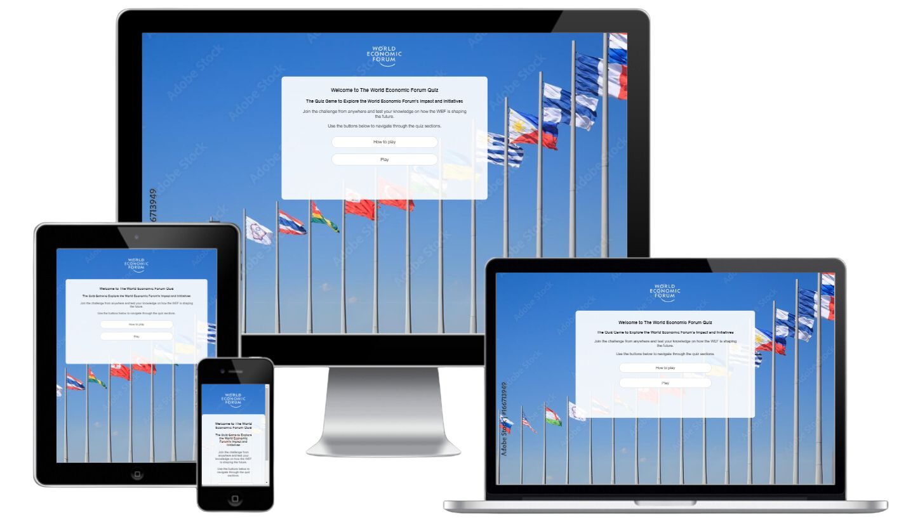
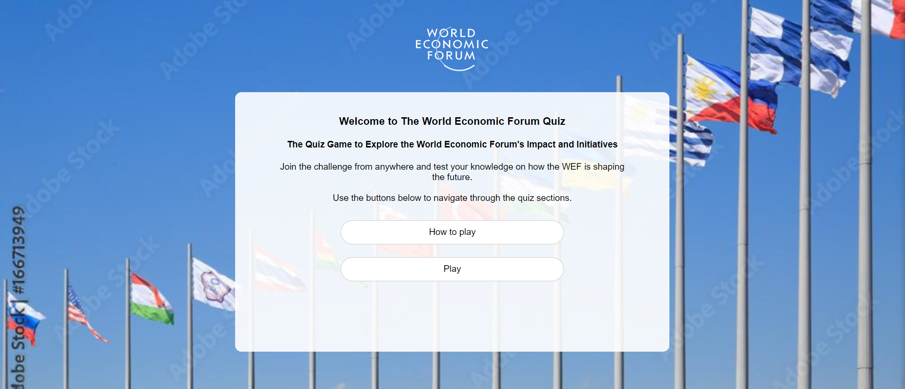
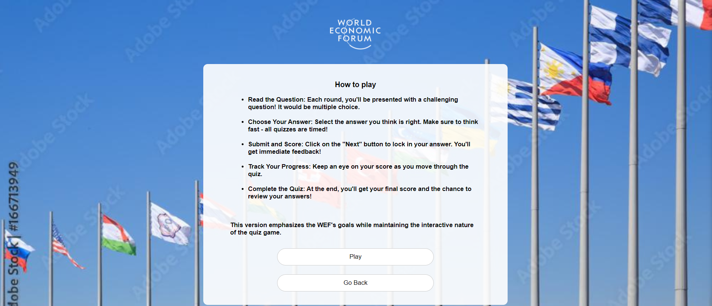
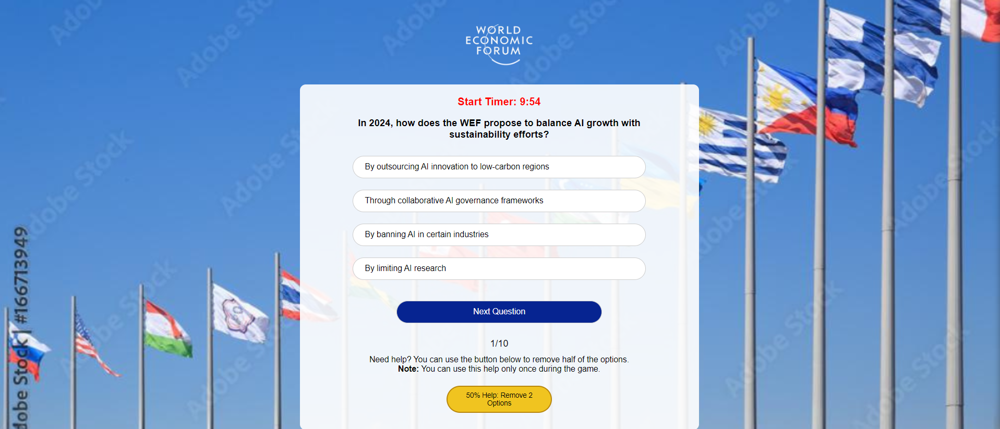
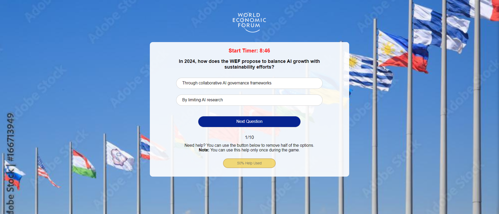
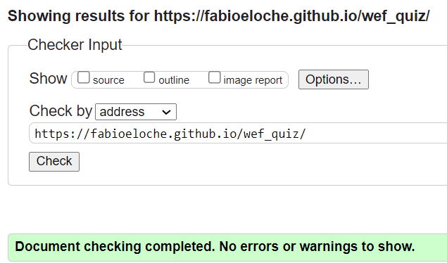
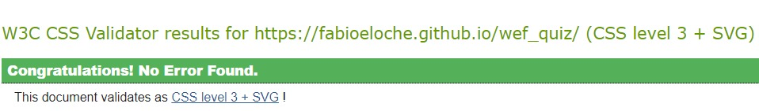
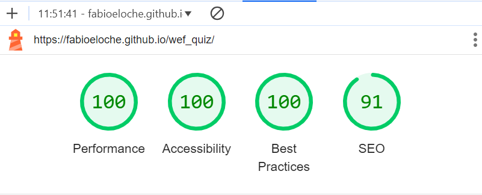

# World Economic Forum Quiz Web App

The **World Economic Forum Quiz Web App** is an interactive platform designed to test your knowledge of the World Economic Forum (WEF), its initiatives, and its impact on global issues. This app presents users with multiple-choice questions, offering an engaging way to learn more about the WEF’s work in areas such as global risks, sustainability, and technological governance.

## Table of Contents
1. [Project Overview](#project-overview)
2. [Design](#design)
   - [Color Scheme](#color-scheme)
   - [Typography](#typography)
   - [Layout](#layout)
3. [Features](#features)
4. [Quiz Structure](#quiz-structure)
   - [Screens](#screens)
   - [Navigation](#navigation)
5. [Technologies Used](#technologies-used)
6. [Testing](#testing)
   - [Validator Testing](#validator-testing)
6. [Deployment](#deployment)
   - [Local Setup](#local-setup)
7. [Future Enhancements](#future-enhancements)
8. [Credits](#credits)

## Project Overview

The **World Economic Forum Quiz Web App** allows users to engage with questions related to the WEF’s latest initiatives and global impact. Users can test their knowledge by answering a series of timed multiple-choice questions. At the end of the quiz, participants are given their results and have the option to review their answers.

The live version of the app can be found at: [Live Site URL](https://fabioeloche.github.io/wef_quiz/).

## Design

### Color Scheme
The website uses a clean white background with black text for readability. Dark blue buttons are used for primary actions, while gold highlights the help button. Correct answers are marked with green, and incorrect ones with red, providing clear feedback throughout the quiz.

### Typography
The app uses **Arial** for its simplicity and readability. The quiz questions are presented in a legible format with an emphasis on clarity.

### Layout
The layout is centered and fully responsive, ensuring that the app works well on all device sizes, from desktops to mobile phones.

## Features

- **Multiple Quiz Screens**: Users are guided through different stages of the quiz, from instructions to final results.
- **Timer**: The quiz includes a countdown timer, adding a challenging aspect to answering the questions quickly and accurately.
- **Help Button**: Users can use a 50% help button to eliminate two wrong options per quiz round, making it easier to answer tough questions.
- **Immediate Feedback**: Upon submitting an answer, users are given feedback on whether their answer was correct or incorrect.
- **Progress Tracking**: Users can track their progress through the quiz with a counter showing the number of questions answered and remaining.
- **Results and Review**: At the end of the quiz, users are presented with their final score and can review their answers to see where they went right or wrong.

## Quiz Structure

### Screens

1. **Welcome Screen**: Introduction to the quiz with buttons to start or read instructions.  

   

2. **Instructions Screen**: Details on how to play the quiz.  

   

3. **Quiz Screen**: Users answer multiple-choice questions with a timer and help options. 

   

4. **Results Screen**: Displays the final score with the option to review answers or restart the quiz.  

   

5. **Help Page**: Allows users to reduce the number of options by 50% (removes two incorrect answers).

   

### Navigation
- **Start Quiz**: Users can enter their name and begin the quiz.
- **Next Question**: Button to proceed to the next question after selecting an answer.
- **Help**: A help button to remove two wrong answers, available only once per quiz.
- **Results**: Users can review their performance after completing the quiz.

## Technologies Used

- **HTML5**: For structuring the content of the quiz web app.
- **CSS3**: For styling the interface and ensuring responsiveness.
- **JavaScript (ES6)**: For implementing the quiz logic, including question shuffling, answer validation, timers, and score tracking.
- **GitHub Pages**: For hosting the live version of the website.

## Testing

- Tested navigation bar elements and buttons across all pages.
- Ensured the input form for the user’s name enforces validation and email syntax rules where applicable.
- Verified that the quiz proceeds only when the required fields are filled.
- Tested the **Help** button functionality and score display at the end of the quiz.
- Verified site compatibility in MS Edge, Chrome, and Safari.
- Verified the responsiveness of all pages across different screen sizes.

### Validator Testing

- **HTML**: Checked with [W3C validator]
   - Result for index.html
(https://validator.w3.org/) for `index.html`.

- **CSS**: Validated with [Jigsaw validator](https://jigsaw.w3.org/css-validator/) for `style.css`.
   - Result for style.css

- **Lighthouse Testing**: Used Google Chrome's Lighthouse to verify performance and accessibility.
   - Result for index.html

## Deployment

The website is deployed using GitHub Pages. Follow these steps to deploy the project:

1. Log in (or sign up) to GitHub.
2. Go to the repository: [fabioeloche/wef_quiz](https://github.com/fabioeloche/wef_quiz).
3. Navigate to the repository’s **Settings** tab.
4. Under the **Code and Automation** section, select the **Pages** option.
5. From the source dropdown, select the **main branch** and save the settings.
6. The site will be deployed within a few minutes. The live version will be accessible at the provided URL once the deployment is complete.

## Credits

- **Inspiration**: The design and structure of this project were partially inspired by [The Quiz Arms](https://github.com/kera-cudmore/TheQuizArms) by Kera Cudmore. It provided valuable insights into quiz functionality and user experience.
- **Background Image**: The background image of fluttering flags against a clear sky was sourced from Adobe Stock. You can view it here: [Flags of Many Countries](https://stock.adobe.com/images/flags-of-many-countries-flutter-on-the-background-of-the-blue-sky-in-sunny-day/166713949).
- **Color Scheme**: The color palette for the project was generated using the Coolors tool, providing a cohesive and visually appealing design. Check it out here: [Coolors](https://coolors.co/).
