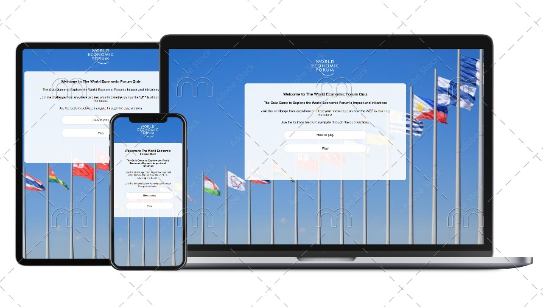

# World Economic Forum Quiz Web App

The **World Economic Forum Quiz Web App** is an interactive platform designed to test your knowledge of the World Economic Forum (WEF), its initiatives, and its impact on global issues. This app presents users with multiple-choice questions, offering an engaging way to learn more about the WEF’s work in areas such as global risks, sustainability, and technological governance.

## Table of Contents
1. [Project Overview](#project-overview)
2. [Design](#design)
   - [Color Scheme](#color-scheme)
   - [Typography](#typography)
   - [Layout](#layout)
3. [Features](#features)
4. [Quiz Structure](#quiz-structure)
   - [Screens](#screens)
   - [Navigation](#navigation)
5. [Technologies Used](#technologies-used)
6. [Deployment](#deployment)
   - [Local Setup](#local-setup)
7. [Future Enhancements](#future-enhancements)
8. [Credits](#credits)
